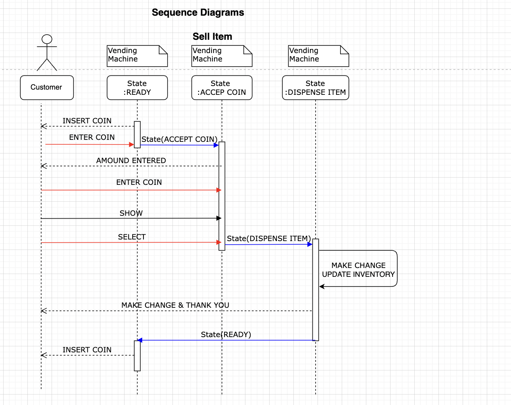

# Vending Machine Software Design Description

 


Table of Contents
-----------------

## Use Case List:

### Customer Use Case
  - Select Product
  - Enter Coin

### Machine Use Case
  - Show Products  
  - Accept Coin
  - Check Coins, Calculate Money
  - Maintain Inventory
  - Make Change
  - Return Coins
  - Sold out
  - Exact Change Only


 

## Vending Machine States

- Ready : Machine ready for new transaction
- AcceptCoin : User selected the product, Machine collecting cash &  or user can cancel the transaction (return coins) 
- DispenseItem : Dispense the product upon successful validation of entered cash,  Give back the change to the user 
 

## Domain Objects, Entities

 - **Product**:  Represent an product inventory served by Vending Machine
 - **Coin**: Represent coin inventory accepted/collected by Vending Machine
 - **ProductPrices**: Represent prices of product by different currency type.
 - **CurrencyType**: Accepted currency types
 - **Language**: Provides multi-language messages. 


## Common Errors
  - InvalidCoinException
  - ExactChangeOnlyException
  - InvalidProductException
  - InvalidStateException
  
## Data Structure


- Product

| SlotId | ProductId | ProductName | RemainingStock | Capacity |
| ------ | --------- | ----------- | -------------- | -------- |
| A1     | 1         | Cola        | 15             | 15       |
| A2     | 2         | Chips       | 10             | 10       |
| A3     | 3         | Candy       | 20             | 20       |
| B1     | 1         | Cola        | 2              | 0        |


-  Coin

| CoinId | Count |
| ------ | ----- |
| 0.05   | 3     |
| 0.10   | 4     |
| 0.20   | 0     |
| 0.50   | 4     |
| 1.00   | 1     |
| 2.00   | 0     |


- ProductPrice

| ProductId | CurrencyId | Price |
| --------- | ---------- | ----- |
| 1         | EUR        | 1.00  |
| 1         | USD        | 1.00  |
| 2         | EUR        | 0.50  |
| 2         | USD        | 0.50  |
| 3         | EUR        | 0.65  |
| 3         | USD        | 0.65  |

- StateTypes: 
Ready = 0,
AcceptCoin = 1, 
DispenseItem = 2

- CurrencyType
  
| CurrencyId |  Unit  | DecimalUnit |
| ---------- | ------ | ----------- |
| EUR        | Euro   | Cents       |
| USD        | Dollar | Cents       |

- Language

| LanguageId |       MessageKey        |         Message         |
| ---------- | ----------------------- | ----------------------- |
| EN         | INSERT_COIN             | INSERT COIN             |
| EN         | AMOUNT_ENTERED          | Amount entered          |
| EN         | REMAINING_AMOUNT        | Remaining amount        |
| EN         | SELECTED_PRODUCT        | Selected product        |
| EN         | PLEASE_TAKE_YOUR_CHANGE | Please take your change |
| EN         | THANK_YOU               | THANK YOU               |
| EN         | RETURNED_MONEY          | Returned money          |


##  Overview


## Sequence Diagram
 


 ## Project Directory Structure

```shell
[Project Structure]
  |-src
     |-Project1
     |-Project2
  |-tests
     |-UnittestProject1
     |-UnittestProject2     
  |-docs
     |- // Documentation stuff, markdown files, help files etc.
  |-build
     |- // Build scripts here  
  |-config
     |- // Any config/config files, images, web-assets, assets needed and such 
```


- `src` - Main projects (the product code)
- `tests` - UnitTest projects.
- `docs` - Documentation stuff, markdown files, help files etc.
- `build` - Build scripts 
- `config` - Any config/resources files, images, web-assets, assets needed and such 
- `Dockerfile` - creates Docker image
- `README.md` - Project readme file.
- `LICENSE`  - license descriptions

References: https://docs.microsoft.com/en-us/dotnet/core/porting/project-structure
https://docs.microsoft.com/en-us/aspnet/core/tutorials/first-web-api?view=aspnetcore-6.0&tabs=visual-studio

## Designing internal architecture of VendingMachine

- VendingMachine designed to run as a microservice in the microservices ecosystem. 

- Following software-architectural concepts are used in the VendingMachine.
   - Domain Driven Design (DDD)
   - CQRS pattern
   - Clean Architecture
   - Mediator Pattern
   - Event Driven Architecture
   - Mediator pattern
   - Test Driven Design (TDD)

- Following container technologies are used in VendingMachine

  - Docker
  - Docker Compose
  - Kubernetes

- VendingMachine microservice has four sub projects:  
  - **Machine.Api:** Rest API interface, it provides only Rest API interfaces to the external world. it doesn't contains any business logic, it forwards all API calls to the "VendingMachine.Application" layer using an event-driven approach. 
  - **Machine.Cli:** Command Line Interface, it provides only command interfaces to the external world. it doesn't contains any business logic, it forwards all request to the "VendingMachine.Application" layer using an event-driven approach.
  - **Machine.Application:**  This project contain `Command handlers` and `Query handlers` which together provide microservice functionality.   
  - **Machine.Domain:**  Domain Models, Aggregate root, Entities.
  - **Machine.Infrastructure:** Data persistence infrastructure, External services.  

- Clean Architecture Layers (Onion view)

  

  Ref: [Microsoft - Clean Architecture (Onion Architecture) ](https://docs.microsoft.com/en-us/dotnet/architecture/modern-web-apps-azure/common-web-application-architectures#clean-architecture)

  

  Ref: [Dependencies between Layers](https://docs.microsoft.com/en-us/dotnet/architecture/microservices/microservice-ddd-cqrs-patterns/ddd-oriented-microservice#the-infrastructure-layer)

- Note: 
  - In this project business logic is not depend on presentation layer (API, CLI or Web layer).
  - The VendingMachine is a decoupled and independent library.
  - VendingMachine is simple class library.
  - it doesn't know which environment is it running.
  - It doesn't know http context and requests.
  - it only receive Command and queries 

